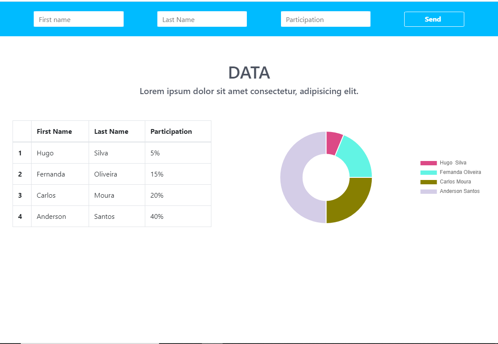

<h1 align="center">
    
</h1>

<p align="center"> 
  Este projeto foi desenvolvido com o intuito de melhorar minhas habilidades em
  ReactJS + TypeScript, sendo um desafio do repositório https://github.com/felipefialho/frontend-challenges, que reúne diversos desafios Front-End.
  <br>
  Você pode testar a aplicação em: https://app.netlify.com/sites/brave-babbage-18ccf2/overview
    
## :computer: Aplicação

### Home 

<p align="center">
  
</p>

## :bulb: Funcionalidades

* Criar Usuários;

* Listar os dados dos Usuários em uma tabela;

* Listar os dados dos Usuários em um gráfico.

## :wrench: Pré-requisitos

 Antes de começar, você vai precisar ter instalado em sua máquina as seguintes ferramentas:
[Git](https://git-scm.com), [Node.js](https://nodejs.org/en/). 
Além disto é bom ter um editor para trabalhar com o código como o [VSCode](https://code.visualstudio.com/)

## :rocket: Para rodar a aplicação

```bash

# Clone este repositório
$ git clone https://github.com/Joaobru/Cubo-Newtwork-Challenge.git

# Acesse a pasta do projeto no seu terminal/cmd
$ cd Cubo-Newtwork-Challenge-master

# Execute o comando nas pastas server/web para instalar todas as dependências
$ npm install ou yarn

# Antes configure os dados do seu banco, na pasta 
# server/src/config/database.js para criar o banco de dados
$ yarn sequelize db:create

# Execute o comando para criar as tabelas
$ yarn sequelize db:migrate

# Execute a aplicação em modo de desenvolvimento, é importante executar este
# comando primeiro no server depois no web ou mobile
$ npm start ou yarn start

# A aplicação será aberta na porta:3000 - acesse http://localhost:3000

```

## 🛠 Tecnologias

  * [Node.js](https://nodejs.org/en/) (Back-End);

  * [ReactJS](https://reactjs.org/) + [TypeScript](https://www.typescriptlang.org/) (Web Front-End);

  * [Postgres](https://www.postgresql.org/) e [Sequelize](https://sequelize.org/) (Banco de Dados);


